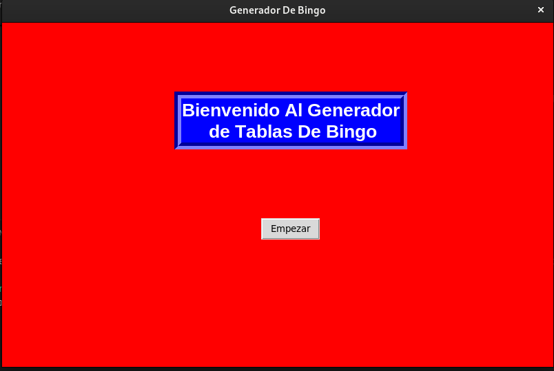

hola este es un proyecto para evaluar mis conocimientos de python, por lo que decidi crear un generado de tablas
de bingo sencillo por lo que su ejecucion es facil.

es indispensable instalar todas las librerias que se encuentran en el archivo librerias.txt para que funcione.

para ejecutarlo hay que correr el archivo interfaz_grafica.py el cual iniciara con el programa en una interfaz
de tkinter.

luego de eso le damos a comenzar para ejecutar el generado el cual creara tambien una carpeta plantillas para mostrar las plantillas que tienen dentro

Se llenan todos los datos que no son obligados y si desear llenarlos puedes hacerlo de todas formas, el nombre debe ser mayor de 5 caracteres o si no no generara 
nada. luego de eso presionamos generar

una vez de lo hayamos hecho nos dara un pdf con el numero de tablas especifico que escojimos si no escojimos ninguno el generador nos dara 1 por defecto.

una ultima sugerencia si planeas generar más de 3 mil tablas llenando con los datos de la cabezera por favor hacerlo de mil en mil ya que el generador no soporta mas de eso 
con los datos.

sin los datos soporta hasta 10 mil tablas generadas de golpe
